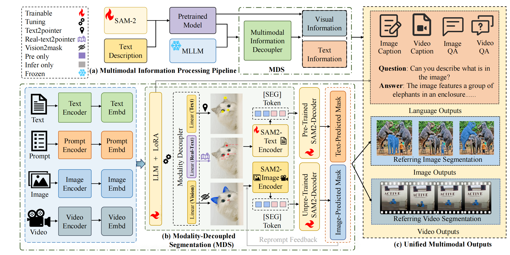
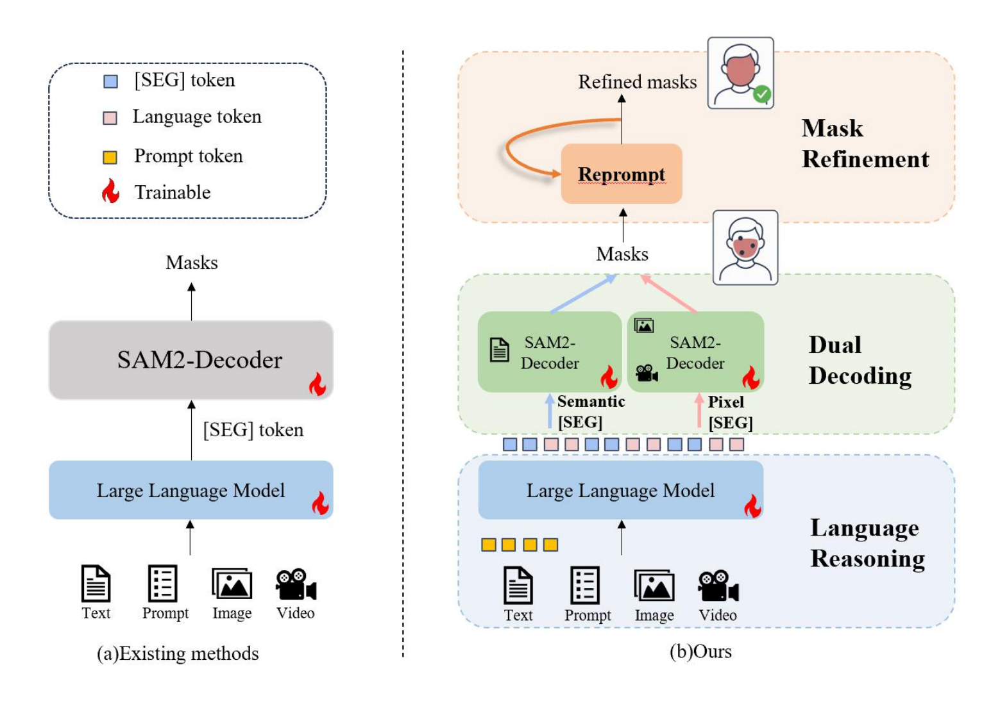
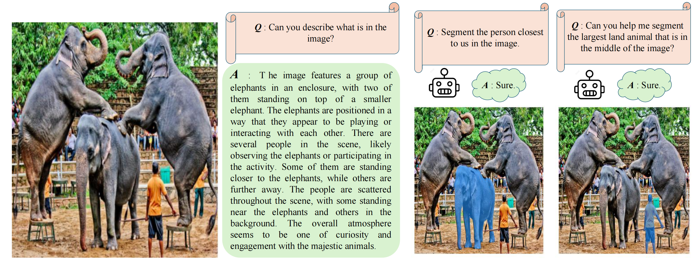

# DeSa2VA

# Decoupled Seg Tokens Make Stronger Reasoning Video Segmenter and Grounder
The official repository of our paper "**Decoupled Seg Tokens Make Stronger Reasoning Video Segmenter and Grounder**".


## Highlights
  1. **Multimodal Information Decoupling Enhanced Prompt**: We propose a novel decoupling strategy, which decouples MLLM-generated annotations into distinct, label-rich text/visual representations, enabling efficient use of signals with minimal training overhead.

  2. **Text Understanding in Segmentation Models**:We introduce a text-visual alignment training, which aligns textual annotations with visual features, training SAM-2 to generate text-grounded masks via supervised loss.

  3. **Effectiveness and Performance**: Our method achieves state-of-the-art results in  segmentation and visual question answering, with ablation studies confirming robust generalization.


## Abstract
Existing video segmenter and grounder approaches, exemplified by Sa2VA, directly fuse features within segmentation models. This often results in an undesirable entanglement of dynamic visual information and static semantics, thereby degrading segmentation accuracy. To systematically mitigate this issue, we propose DeSa2VA, a decoupling-enhanced prompting scheme integrating text pre-training and a linear decoupling module to address the information processing limitations inherent in SAM-2. Specifically, first, we devise a pre-training paradigm that converts textual ground-truth labels into point-level prompts while generating corresponding text masks. These masks are refined through a hybrid loss function to strengthen the model's semantic grounding capabilities. Next, we employ linear projection to disentangle hidden states that generated by a large language model into distinct textual and visual feature subspaces. Finally, a dynamic mask fusion strategy synergistically combines these decoupled features through triple supervision from predicted text/visual masks and ground-truth annotations. Extensive experiments demonstrate state-of-the-art performance across diverse tasks, including image segmentation, image question answering, video segmentation, and video question answering.

## Model Overview
<p align="center">

</p>

<p align="center">

</p>

## Examples
<p align="center">

</p>

## Demo
You can explore our demo by running `demo.ipynb`. This demonstration illustrates the segmentation capabilities and video understanding abilities of DeSa2VA.

## Requirements

<details open>
<summary>Installation</summary>

1. Please install the python and pytorch first:
```bash
> conda create -n vlm python=3.10
> conda activate vlm
> conda install pytorch==2.3.1 torchvision==0.18.1 pytorch-cuda=12.1 cuda -c pytorch  -c "nvidia/label/cuda-12.1.0" -c "nvidia/label/cuda-12.1.1"
```

2. Install mmcv, we use 2.1.0 as default version:
```bash
> pip install mmcv==2.1.0 -f https://download.openmmlab.com/mmcv/dist/cu121/torch2.3/index.html
```

3. Install other dependencies:
```bash
> pip install -r requirements.txt
```
</details>

Please make sure using the correct versions of transformers and peft.

**Before running `pip install -e .`, ensure you have the correct requirements.**


## Dataset

<summary>Data Preparation</summary>
Please download the training datasets and place them in the `data` directory. The download link is [here](https://huggingface.co/datasets/Dense-World/Sa2VA-Training).
The final data structure should be like:

  ```
data/
├── video_datas
|   ├── revos
|   ├── mevis
|   └── davis17
|   └── chat_univi # video-chat data
|   └── sam_v_full # please download this from sam-2 offical repp.
|   └── sam_v_final_v3.json
├── ref_seg
|   ├── refclef
|   ├── refcoco
|   ├── refcoco+
|   ├── refcocog
|   ├── 
├── glamm_data
|   ├── images
|   ├── annotations
├── osprey-724k
|   ├── Osprey-724K
|   ├── coco
├── llava_data
|   ├── llava_images
|   ├── LLaVA-Instruct-150K
|   ├── LLaVA-Pretrain

```
`sam_v_full` is the SA-V dataset, which is not included in the download link. You can download it from [here](https://ai.meta.com/datasets/segment-anything-video/).
</details>

## Training

### Download Pre-trained Models
You are expected to download the following pretrained models and place them in the `./pretrained` directory:
- [sam2_hiera_large.pt](https://huggingface.co/facebook/sam2-hiera-large)
- [InternVL2_5-4B](https://huggingface.co/OpenGVLab/InternVL2_5-4B)

You can download the remaining models from InternVL2.5 [huggingface collections](https://huggingface.co/collections/OpenGVLab/internvl25-673e1019b66e2218f68d7c1c). 

```
./ # project root
pretrained/
├── sam2_hiera_large.pt
├── InternVL2_5-1B
├── InternVL2_5-4B
```

<details open>
<summary>Training Script</summary>

Please run the following script to train using 8 GPUS, we suggest using at least 8 H800 GPUs:
```bash
> bash tools/dist.sh train projects/llava_sam2/configs/desa2va_4b.py 8
```
</details>

### Evaluation on datasets
You can validate each dataset through commands, here is an example that provides the validation instructions for the DAVIS dataset:
```bash
> PYTHONPATH=. python projects/llava_sam2/evaluation/ref_vos_eval.py --model_path /your/model/path --dataset DAVIS
```
</details>

## Video
  Coming soon!

## Acknowledgement
We referenced the repo below for the code
- [Sa2VA](https://github.com/magic-research/Sa2VA)
